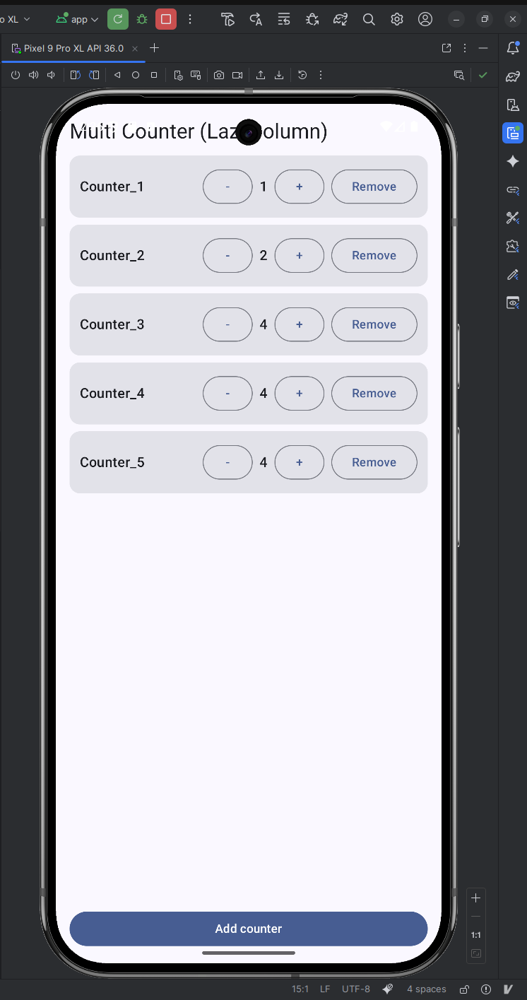

# Multi Counter (LazyColumn)

A simple Android app written in Kotlin that shows a scrollable list of independent counters.  
Each counter has its own + / – buttons and can be removed. New counters can be added at runtime.

## Features

- [x] Scrollable list of counters using `LazyColumn`
- [x] Each counter has its own value and name (`Counter_1`, `Counter_2`, …)
- [x] Increment and decrement buttons for every counter
- [x] Optional feature: add a new counter at the bottom
- [x] Optional feature: remove an existing counter

## Tech Stack

- Android (Kotlin, Jetpack Compose)
- UI: Material 3 components
- State management: `remember` / `mutableStateListOf`
- Layout: `LazyColumn` for the list of counters

## Screenshot

## How to Run

1. Clone this repository.
2. Open the project in **Android Studio (Koala or newer)**.
3. Sync Gradle if needed.
4. Run the app on an emulator or physical device (API 26+).

