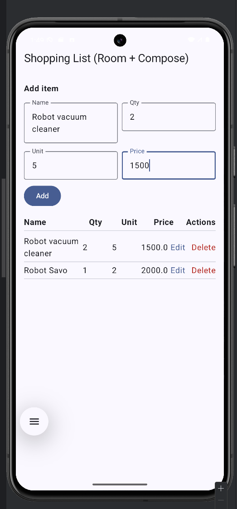

# ShoppingListRoomApp

Simple Android app built with **Kotlin**, **Jetpack Compose**, and **Room**.  
It stores a shopping list locally using SQLite and displays items in a table layout.

## Features
- Add items with **Name**, **Quantity**, **Unit**, **Price**
- Store data using **Room Database**
- Display items in a table (Name, Qty, Unit, Price, Actions)
- **Edit** and **Delete** items
- Live updates using **ViewModel + Flow**
- View saved data with **Database Inspector**

## Tech Stack
- Kotlin 2.0.21  
- Jetpack Compose (Material 3)  
- Room (room-runtime, room-ktx, ksp compiler)  
- ViewModel + StateFlow  
- Min SDK 35, Target SDK 36  

## How to Use
1. Enter Name, Qty, Unit, Price → press **Add**
2. Items appear in the table below
3. Tap **Edit** to modify an item  
4. Tap **Delete** to remove it

## Database Inspector
Run the app →  
Android Studio → **View → App Inspection → Database Inspector**  
Check `shopping_db` → `shopping_items`.

## Screenshots

## Database Inspector

Android Studio → View → App Inspection → Database Inspector → shopping_db → shopping_items

