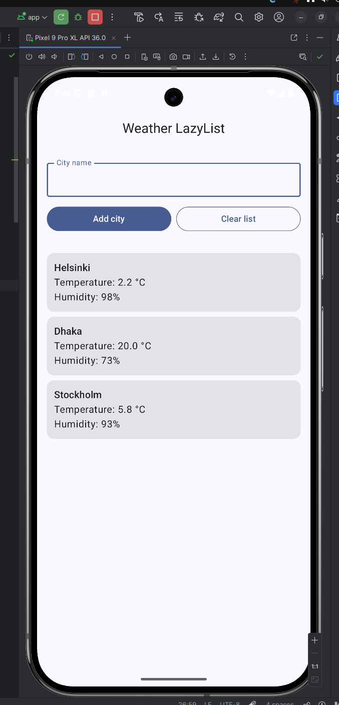

# WeatherLazyList

WeatherLazyList is a simple Android app built with Kotlin and Jetpack Compose.  
It fetches the current weather for a city from the OpenWeather API and shows the
results in a scrollable list (LazyColumn).

## Features

- [x] Search weather by **city name**
- [x] Shows **temperature (°C)** and **humidity (%)**
- [x] Supports **multiple cities** stacked in a LazyColumn
- [x] Button to **clear the list**
- [x] Basic loading and error messages (e.g. network error, invalid API key)

## Tech Stack

- Android (Kotlin, Jetpack Compose)
- Architecture: MVVM (`WeatherViewModel`, `WeatherRepository`)
- Networking: Retrofit + Gson (`WeatherService`)
- State: `StateFlow` + `collectAsState()` in Compose
- API: [OpenWeather Current Weather Data](https://openweathermap.org/current)

## Screenshots

_(Update the path/file name based on your repo)_

